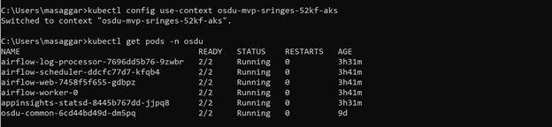
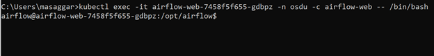
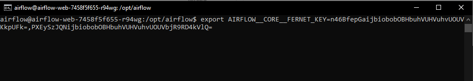
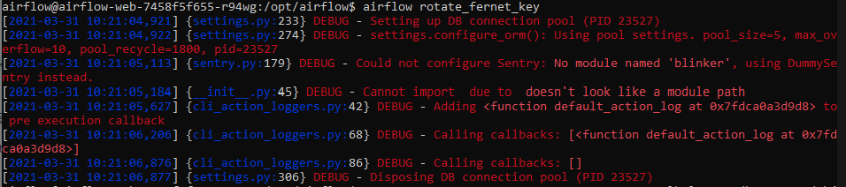
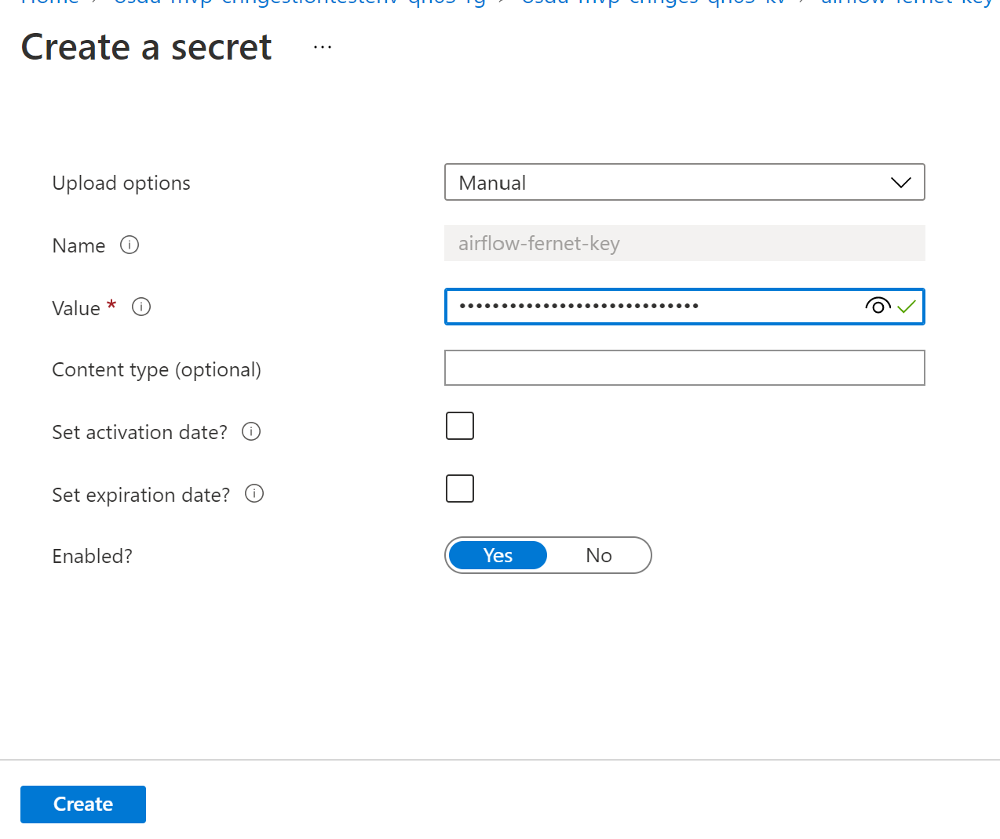
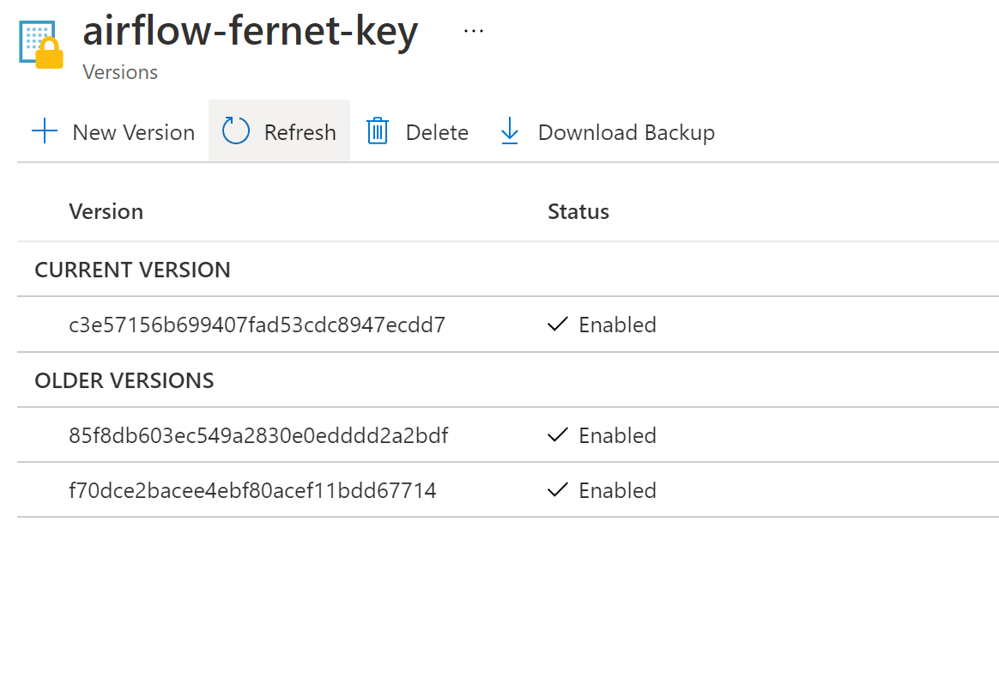
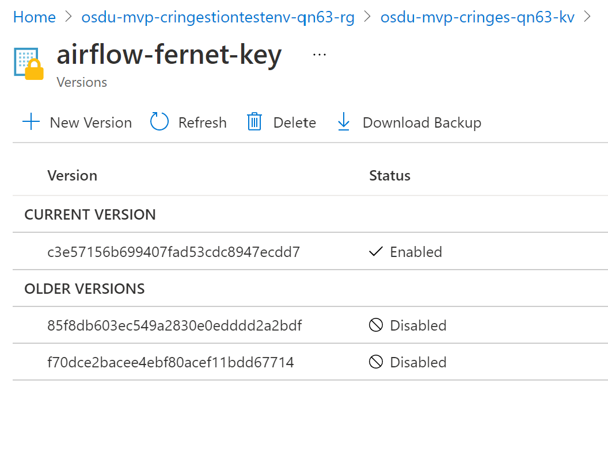

# Fernet Key for securing airflow connections and variables

Airflow uses **Fernet** to encrypt passwords in the connection configuration and the variable configuration. It guarantees that a password encrypted using it cannot be manipulated or read without the key. Fernet is an implementation of symmetric (also known as “secret key”) authenticated cryptography.

The fernet key for deployment is stored in the KeyVault as airflow-fernet-key.

Airflow recommends that the fernet key be rotated periodically for better security and provides a mechanism for the same.

## Fernet Key Rotation

Once connection credentials and variables have been encrypted using a fernet key, changing the key will cause decryption of existing credentials to fail. To rotate the fernet key without invalidating existing encrypted values, prepend the new key to the **fernet_key** setting, run **airflow rotate_fernet_key**, and then drop the original key from **fernet_keys**. We need access to the airflow deployment pod to do this.

### Step 1: Generate a new key

To generate a new key run the python script below and note the key for future use:

``` Python
from cryptography.fernet import Fernet
fernet_key= Fernet.generate_key()
print(fernet_key.decode())
```

### Step 2: Accessing the pod terminal

Access the command line interface to execute the command open a PowerShell/bash-shell from where you can run the kubectl commands. Set the subscription and the context for the AKS Cluster by using the below commands. Here cluster name is the name of AKS deployment in ms-azure portal and the resource-group containing it.

``` Command-Line
az account list -o table
az account set --subscription "<name>"
az aks get-credentials --resource-group "<resource-group>" --name "<cluster-name>"
kubectl config set-context "<cluster-name>" --cluster="<cluster-name>"
kubectl config use-context "<cluster-name>"
```

Once the context is set for the AKS-cluster run

``` Command-Line
kubectl get pods -n osdu
```



Select a airflow pod for eg airflow-web-xxxxxxxxx or airflow-scheduler-xxxxxxxxx and run

``` Command-Line
kubectl exec -it <pod-name> \
-n <namespace> \
-c <container> \
-- /bin/bash
```



### Step 3: Rotating the keys

Set fernet_key to new_fernet_key,old_fernet_key

``` Command-Line
export AIRFLOW__CORE__FERNET_KEY=<new key>,<old key>
```



Run airflow rotate_fernet_key to re-encrypt existing credentials with the new fernet key

``` Command-Line
airflow rotate-fernet-key
```



### Step 4: Setting the value correctly in the Key Vault

Sign in to the Azure portal. Go to the Key Vault for your deployment. Select Secrets on the left menu. (You need List permissions on this KeyVault). Select ```airflow-fernet-key```.

Click on **New Version**



Type in the secret value and click **create**.



Now disable the older secret values by editing them. After some time the airflow pods will refresh with the latest values from the KeyVault.



**Note: There is a known issue/bug, where in the default behavior of pulling the latest values for secrets and refreshing pods environment values is not occuring and is tracked under the issue [here](https://community.opengroup.org/osdu/platform/deployment-and-operations/infra-azure-provisioning/-/issues/145).**