# RBAC in Airflow UI, User Roles and Permissions

To enable users to control access to the Airflow Web UI, the airflow deployment will have RBAC for Web-Server authentication enabled. What this means is that users can create different users having different levels of access and Workflow DAG level access. It comes with pre-built roles which makes it easy to implement. Not stopping there, one could add their own roles as well.

- Admin – Has all the permissions. Has access to do everything.

- Viewer – Can only use the Airflow Web UI to see the status but cannot launch DAGs or change anything else. This is also Read-only access.

- Ops – Ability to modify the configuration.

- Users – Able to perform DAG related tasks – marking DAGs/tasks as failed or successful. Able to launch DAGs etc.

- Public – Role with permissions for unauthenticated users.

## Creating User for RBAC

***

### Using Command Line Interface

Airflow users can be created via the command-line interface. Using the following command

``` Command-Line
airflow create_user \
  --role Admin \
  --username $USER_FIRST \
  --firstname $USER_FIRST \
  --lastname $USER_LAST \
  --email $EMAIL \
  --password $PASSWORD
```

To access the command line interface to execute this command open a PowerShell/bash-shell from where you can run the kubectl commands. Set the subscription and the context for the AKS Cluster by using the below commands. Here cluster name is the name of AKS deployment in ms-azure portal and the resource-group containing it.

``` Command-Line
az account list -o table
az account set --subscription "<name>"
az aks get-credentials --resource-group "<resource-group>" --name "<cluster-name>"
kubectl config set-context "<cluster-name>" --cluster="<cluster-name>"
kubectl config use-context "<cluster-name> "
```

Once the context is set for the AKS-cluster run

``` Command-Line
kubectl get pods -n osdu
```


Enter either of the pods of **airflow-scheduler** or **airflow web** by running the command:

``` Command-Line
kubectl exec -it <pod-name> \
-n <namespace> \
-c <container> \
-- /bin/bash
```


Now here run the create_user command in the format specified above

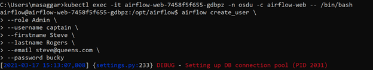
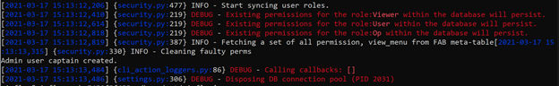

On the Airflow Web UI, a Login screen will be present after refresh


Enter the username password created in the previous steps.

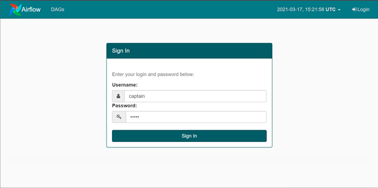


Other type of users can also be created in the similar fashion. Different types available out of the box are: Admin, Viewer, Ops, User, Public.

### Creating new Users via the Web UI

Step 1 – Navigate to **Security->List Users**.
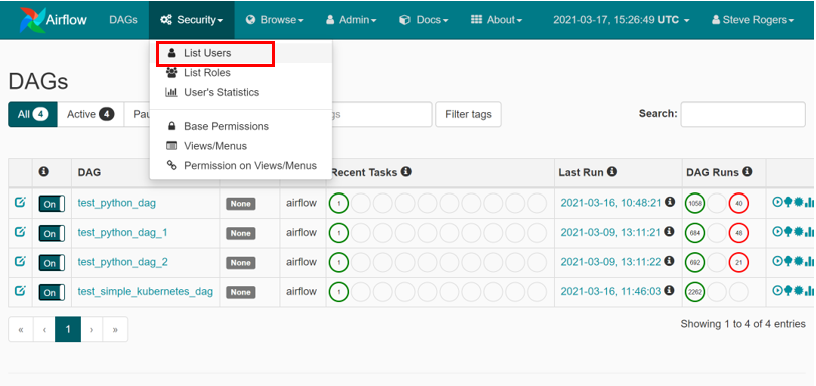

Step 2 – Click on the **+ button.**
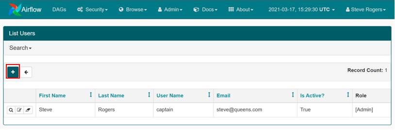

Step 3 – Fill in the details and press **Save.**

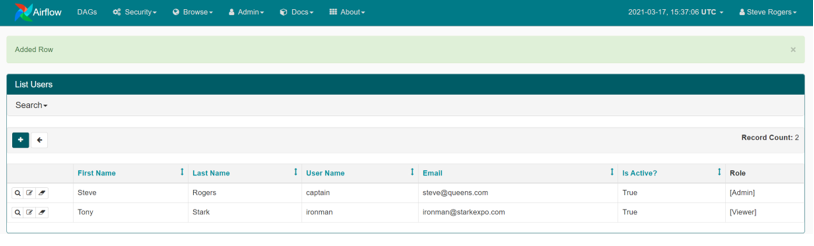

### Creating Admin User during post deployment phase via a python script

Another method for creating the first user is being provided in the form of a python script. The existing/old method of creating a user for Airflow Experimental APIs and Web UI Password Authentication, has been updated to create a user for RBAC enabled Web UI. One needs to set the following rbac create-user flag in the helm-config.yaml for charts-airflow to True.

``` Yaml
################################################################################
# Specify any custom configs/environment values
#
customConfig:
  rbac:
    createUser: "True"
    enabled: "True"
```

## Roles and Permissions

Airflow 1.10.X is built using Flask-AppBuilder. Flask-AppBuilder has a security manager which formed the basis for Airflow’s RBAC security model. Users are assigned roles and each role has a set of permissions. Permissions are given to various objects – Views, Menus and DAGs. Which secures the airflow. All the Views, Menus and DAGs are listed on the Airflow Web UI on the following navigation path **Security->View/Menus**.

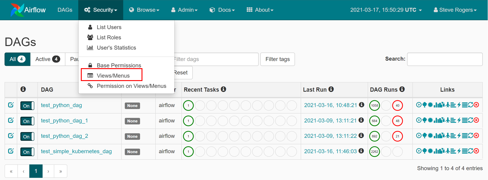

It opens the following view/list at the end of which you will find the Dags, which means that dags can also be secured.

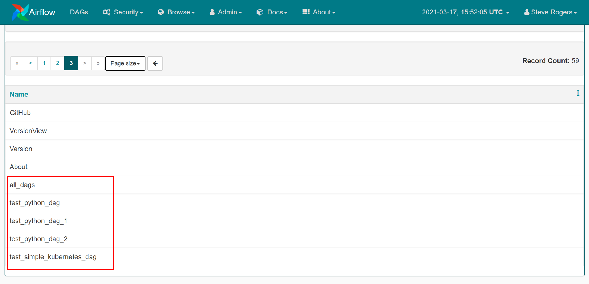

For more details read the permissions section on [Flask AppBuilder Security](https://flask-appbuilder.readthedocs.io/en/latest/security.html).

In addition to securing menu items and views. airflow also allows us to secure what operations are performed on the secured menu items. It does so by assigning permissions to a particular menu item or view. All these permissions are clubbed together under **Security->Base Permissions**.

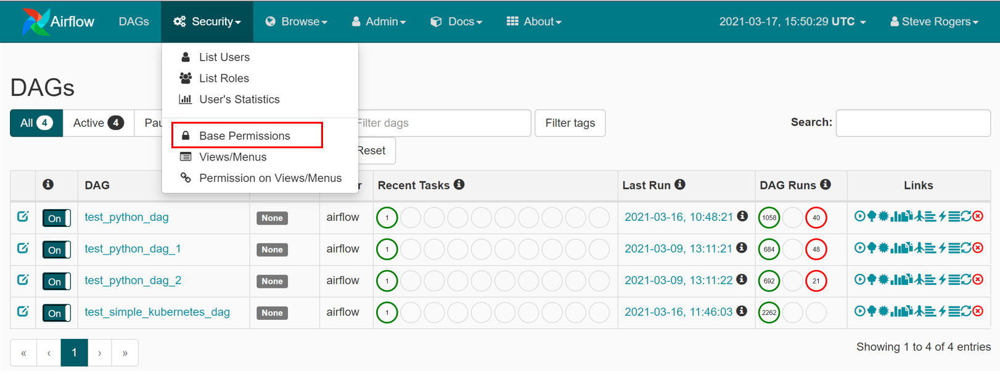
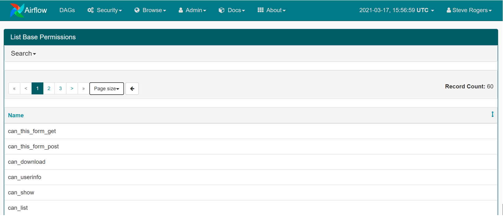
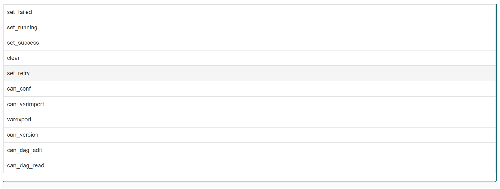

Here it shows that DAG edit and read access permissions can also be granted and taken away.

A list of all the combinations on Views and Permissions in airflow is available on **Security->Permissions on Views and Menus**.

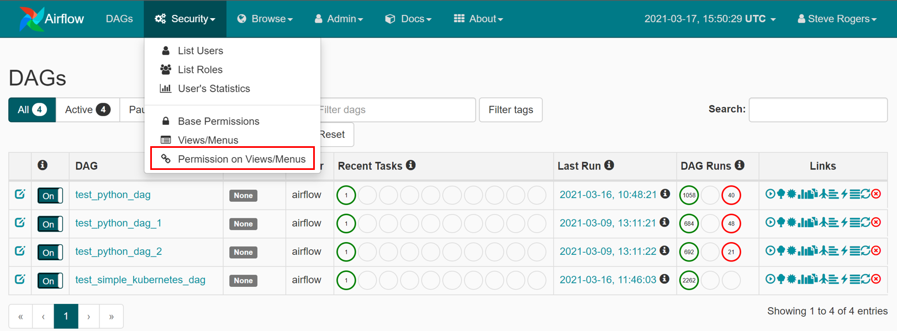
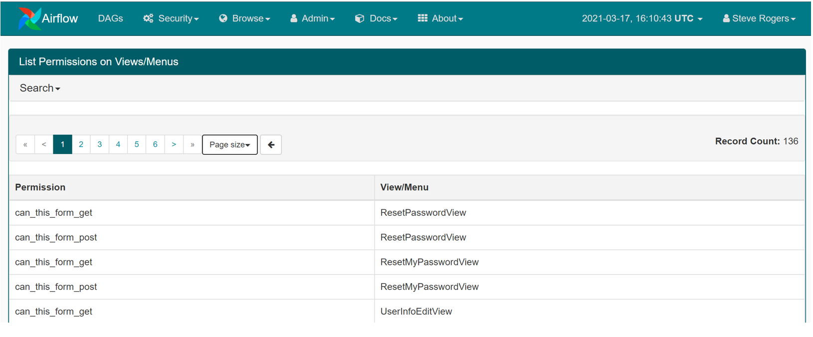

These permissions can be utilized while creating new roles.

## Creating a Role

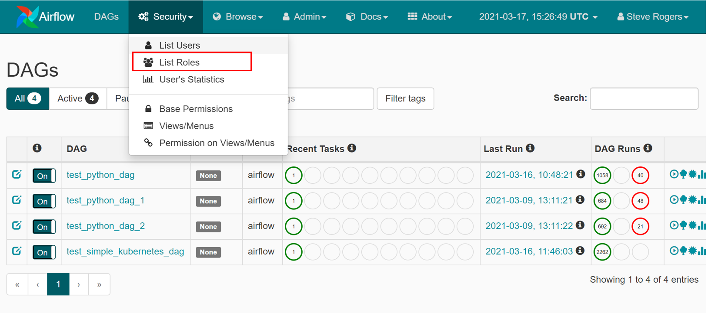
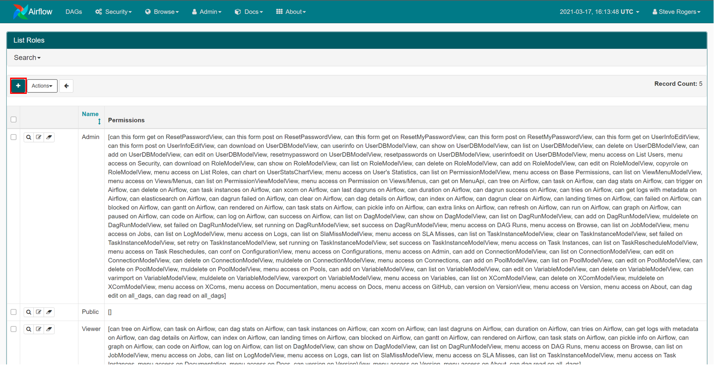

Press the **“+”** icon. By default, when you create a role – airflow adds a few menu/view and base permissions combinations by default. All that airflow does is that we are able to see the menu items though one does not get access to any functionality.

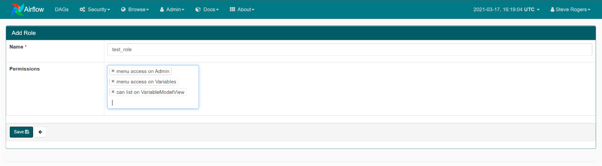
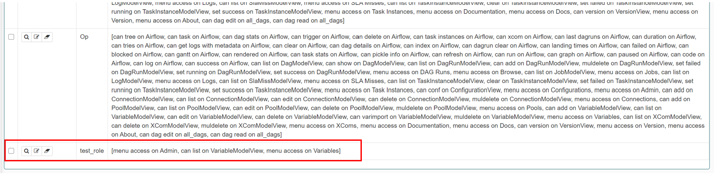

On refreshing the page one can see that airflow has added some additional combinations of view/menu and base permissions.

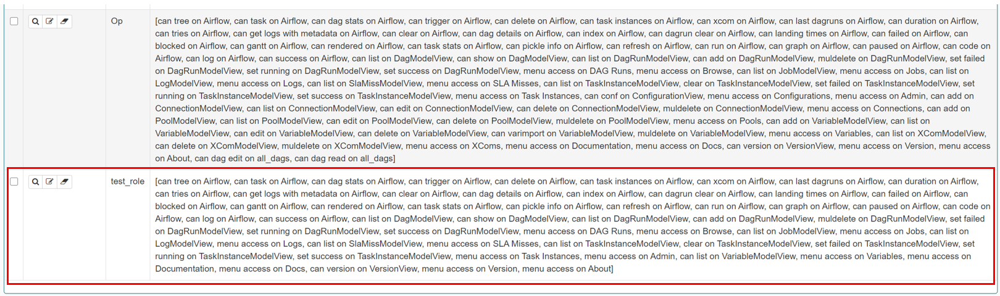

### Create a new user from the WEB UI part and assign this role to the user

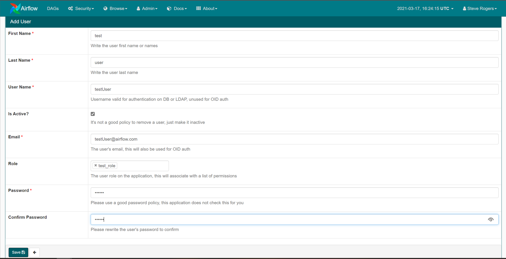

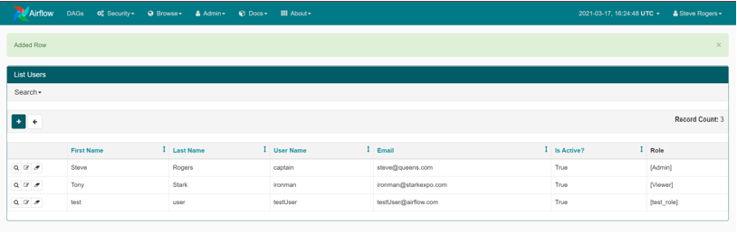

Now try login the new user to see if it works.

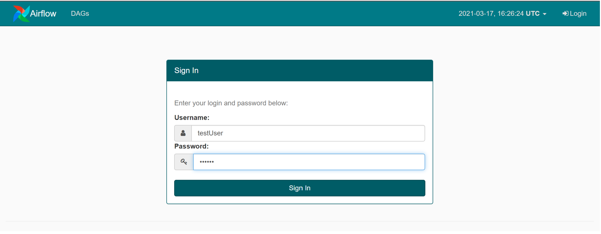

As one can see no DAGs are visible and the Admin->Variable Menu is visible.

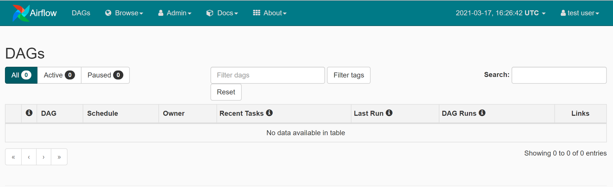

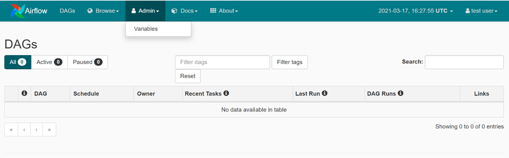

### Secure DAGs with RBAC

Login with the admin account and edit the test role to perform DAG read on the test_python_dag (eg.) click save and login with the testUser to see the changes.

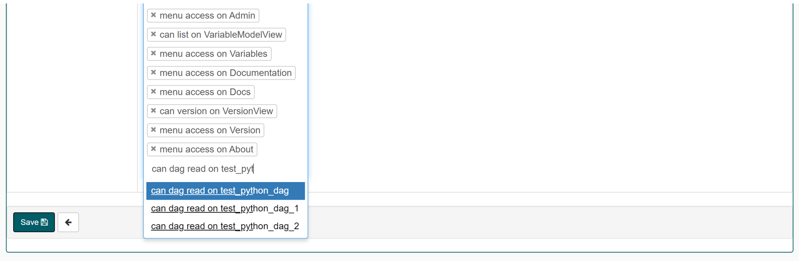

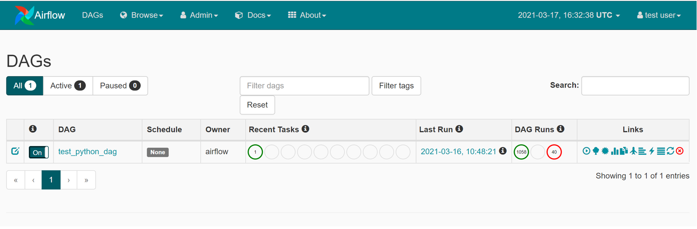

If one tries to trigger DAG from the UI, one will get an Access denied message on home page after redirected back to home.
