# RBAC from Azure

## Creating group in Azure Active Directory for user access management

Groups in AAD are used to manage member and computer access to shared resources for a group of users. For example, one can create a dev ops group to provide access to all logs related to a particular resource or resource group or number of resource-groups even subscriptions. By doing it this way, you can give a set of permissions to all the members at once, instead of having to add permissions to each member individually. A security group can have users, devices, groups and service principals as its members and users and service principals as its owners. To create a basic group using Azure Portal:

1. Sign into the Azure Portal using a Global Administrator account for the directory.
2. Search for and select **Azure Active Directory**.
3. On the Active Directory page, under **Manage** select **Groups** and then select **New group**.

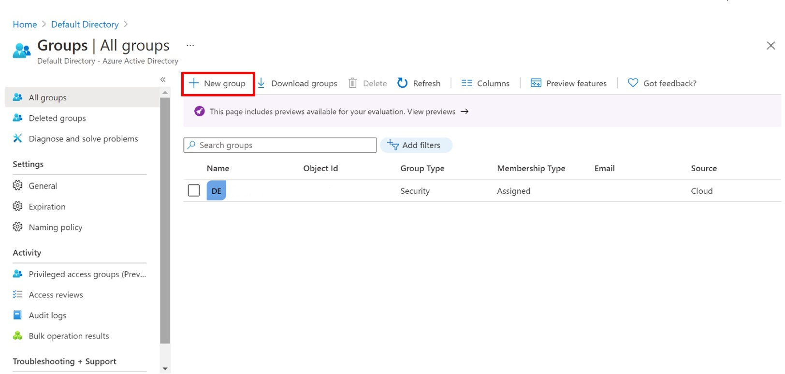

4. Fill in the required information in the new Group blade.

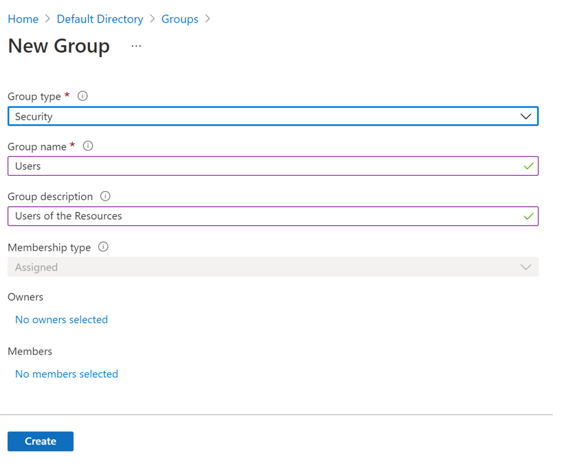

5. Select a pre-defined **Group type**.
6. Create and add a Group name. Choose a name that you'll remember and that makes sense for the group. A check will be performed to determine if the name is already in use by another group. If the name is already in use, to avoid duplicate naming, you'll be asked to change the name of your group.
7. Group description. Add an optional description to your group.
8. Select Create. Your group is created and ready for you to add members.
9. Select the Members area from the Group page, and then begin searching for the members to add to your group from the Select **members’** page.

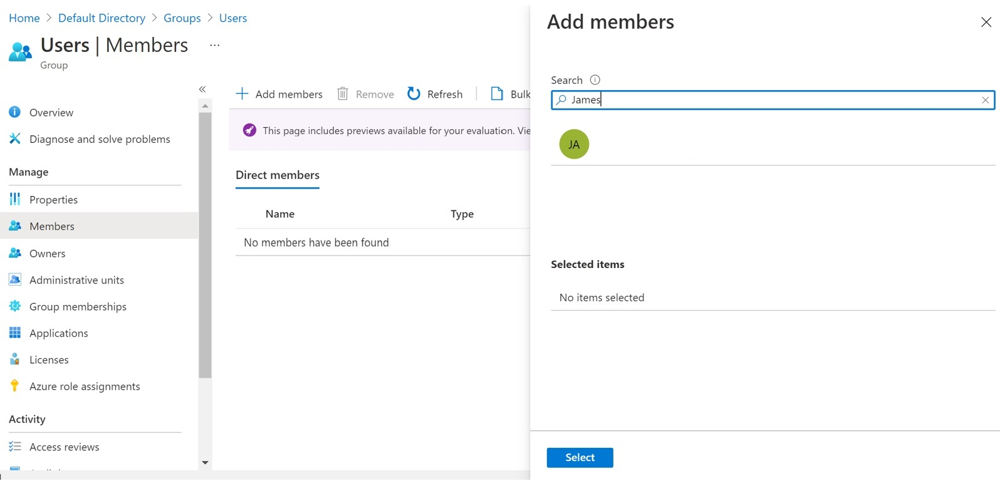

10.	When you're done adding members, choose Select. 
The Group Overview page updates to show the number of members who are now added to the group.

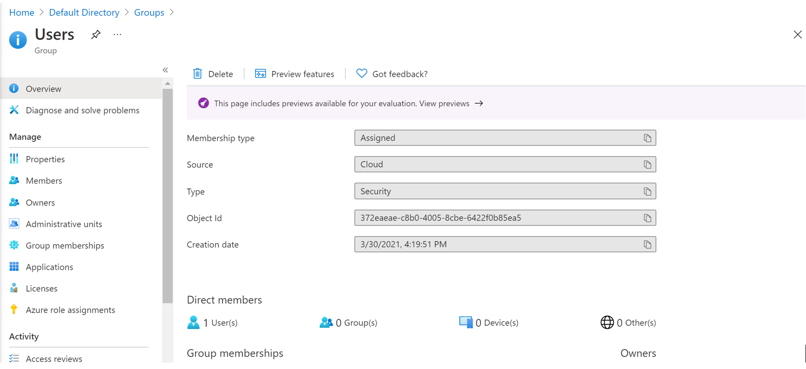

For more information on group types, see [Group and membership types](https://docs.microsoft.com/en-us/azure/active-directory/fundamentals/active-directory-groups-create-azure-portal#group-types)

## Managing Access via AAD Groups

Azure AD helps you give access to your organization's resources by providing access rights to a single user or to an entire Azure AD group. Using groups lets the resource owner (or Azure AD directory owner), assign a set of access permissions to all the members of the group, instead of having to provide the rights one-by-one. The resource or directory owner can also give management rights for the member list to someone else, such as a department manager or a Helpdesk administrator, letting that person add and remove members, as needed.

The resource owner assigns an Azure AD group to the resource, which automatically gives all the group members access to the resource. Group membership is managed by both the group owner and the resource owner, letting either owner add or remove members from the group. For e.g. In the below image the Storage Access group has a contributor type access related to this storage account. Detailed process in next section.

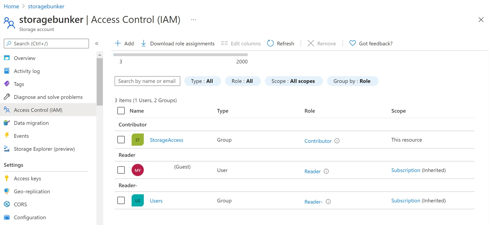

## RBAC in Azure resources

Prerequisites: To assign Azure roles, you must have **Microsoft.Authorization/roleAssignments/write** permissions, which are a part of **User Access Administrator** or **Owner**.

### Identifying the scope

Scope is the set of resources the access applies to and occurs in a top to bottom fashion for Management Group, Subscription, Resource group and resource. For e.g., to add a Storage contributor for only a particular account you would limit the scope to that Storage account, and to add as a contributor across a set of accounts you made add a list.

It's a best practice to grant security principals the least privilege they need to perform their job. Avoid assigning broader roles at broader scopes even if it initially seems more convenient. By limiting roles and scopes, you limit what resources are at risk if the security principal is ever compromised. Specifying the scope as resource group means that the role is propagated to all the resources in that resource group. Similar fashion when we add a role assignment to subscription, the assignment gets inherited by all the resources and resource groups under that subscription.

For this exercise we will add the role to a resource group. For this exercise we will add the role to a resource group:

* Login to the Azure portal.
* In the search box on top of page, search for the resource group(scope) and select it.

### Open the Role Assignment Pane

* To add, remove, edit role assignments one can do from the Access Control (IAM) or the Identity and Access Management which appears at several locations in the azure portal.

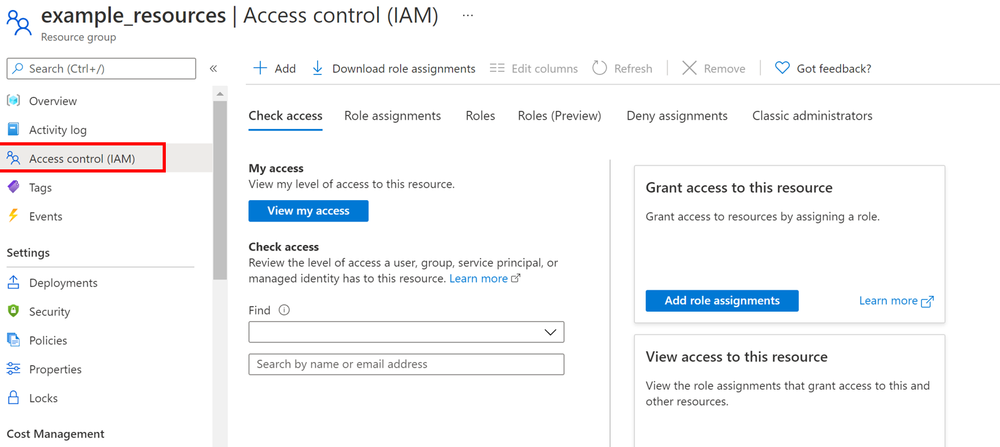

* Click the Role assignments tab to view the role assignments at this scope.
* Click Add > Add role assignment. If you don't have permissions to assign roles, the Add role assignment option will be disabled.

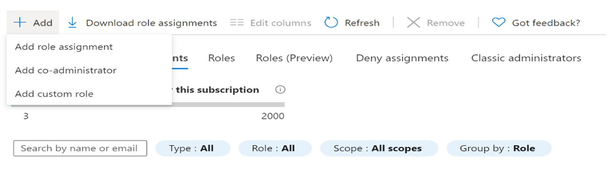

* The role assignment pane opens.

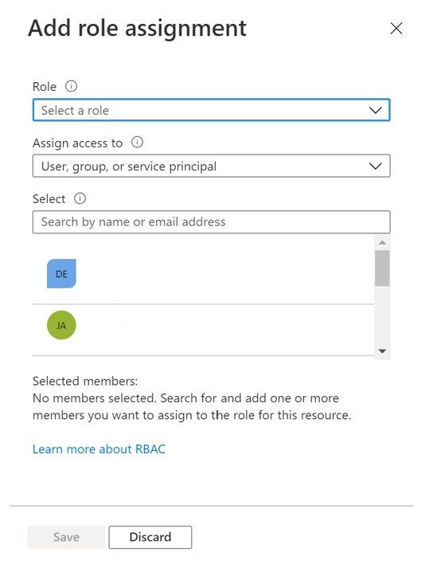

### Select the appropriate role

* In the Role list, search or scroll to find the role that you want to assign.

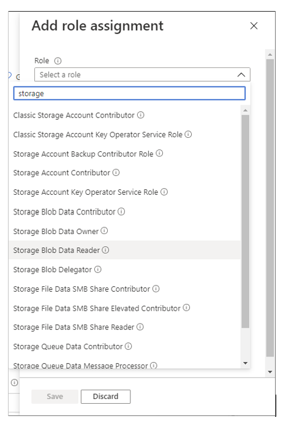

* Click to select the role and save it.

### Select who needs access

* In the Assign access to list, select the type of security principal to assign access to.
* **User, group, or service principal**: If you want to assign the role to a user, group, or service principal (application), select this type.
* **User assigned managed identity**: If you want to assign the role to a user-assigned managed identity, select this type.
* **System assigned managed identity**: If you want to assign the role to a system-assigned managed identity, select the Azure service instance where the managed identity is located.

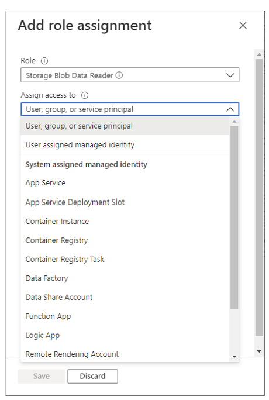

* In the Select section, search for the security principal by entering a string or scrolling through the list.

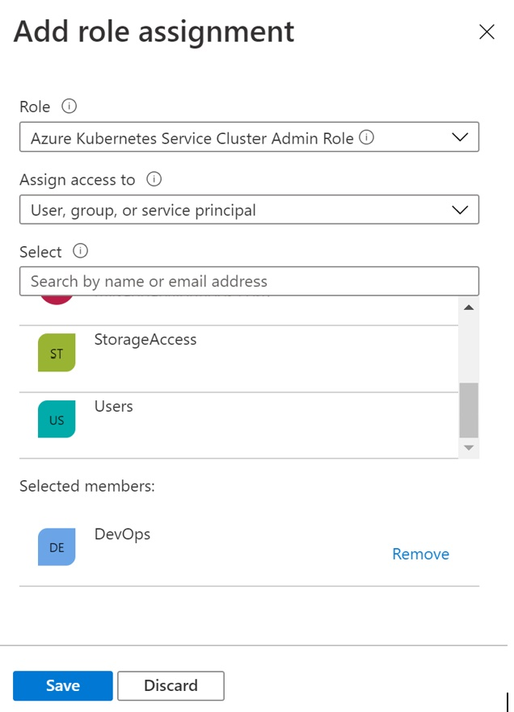

### Assign Role

To assign the role, click Save. After some time, the security principal is assigned the role at the selected scope. On the Role assignments tab, verify that you see the role assignment in the list.

For more info on Azure Built In roles refer here: [Azure built-in roles - Azure RBAC | Microsoft Docs](https://docs.microsoft.com/en-us/azure/role-based-access-control/built-in-roles)

Refer here to understand scope of a user Role: [Understand scope for Azure RBAC | Microsoft Docs](https://docs.microsoft.com/en-us/azure/role-based-access-control/scope-overview)

For more information refer and methods refer the below docs:
[Classic subscription administrator roles, Azure roles, and Azure AD roles | Microsoft Docs](https://docs.microsoft.com/en-us/azure/role-based-access-control/rbac-and-directory-admin-roles) | [Assign Azure roles using Azure CLI - Azure RBAC | Microsoft Docs](https://docs.microsoft.com/en-us/azure/role-based-access-control/role-assignments-cli)

## Creating Custom Roles for Access management

Azure RBAC provides the users to create custom roles if the built-in roles don’t provide the needed flexibility and resource access management. Just like built-in roles, you can assign custom roles to users, groups, and service principals at subscription and resource group scopes. Custom roles are stored in an Azure Active Directory (Azure AD) directory and can be shared across subscriptions. Each directory can have up to 5000 custom roles. Custom roles can be created using the Azure portal, Azure PowerShell, Azure CLI, or the REST API.

To create a custom role through the portal:

1. Determine the permissions you need. Azure has thousands of permissions that you can potentially include in your custom role. A look at the existing permissions/azure built in roles can give one an idea of what permissions one needs.

2. Choose how to start. To create a custom role Azure provides 3 ways to do so. 
    * Cloning existing role.
    * Start from scratch.
    * Start with a json.

For this doc we will create by cloning an existing role. For the other 2 methods please refer [here](https://docs.microsoft.com/en-us/azure/role-based-access-control/custom-roles-portal#step-2-choose-how-to-start)

Cloning an existing role:

* If an existing role does not quite have the permissions you need, you can clone it and then modify the permissions.
* In the Azure portal, open a subscription or resource group where you want the custom role to be assignable and then open Access control (IAM).

* Click the Roles tab to see a list of all the built-in and custom roles. Search for a role you want to clone such as the Azure Kubernetes Service Cluster User Role. At the end of the row click on the 3 dots (…) and then click clone. This opens the custom roles editor with the Clone a role option selected.

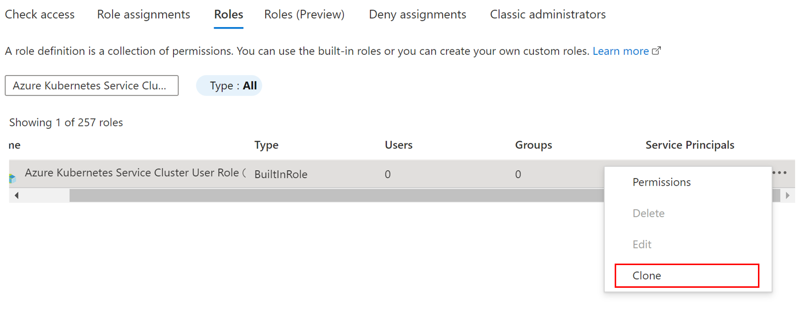

3. On the Basics tab, you specify the name, description, and baseline permissions for your custom role. In the Custom role name box, specify a name for the custom role. The name must be unique for the Azure AD directory. The name can include letters, numbers, spaces, and special characters. The Baseline permissions option should already be set based on the previous step, but you can change.

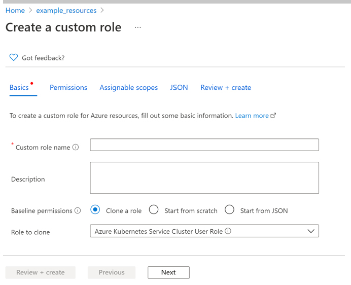

4. On the Permissions Tab.

    * On the Permissions tab, you specify the permissions for your custom role. Depending on whether you cloned a role or if you started with JSON, the Permissions tab might already list some permissions.
    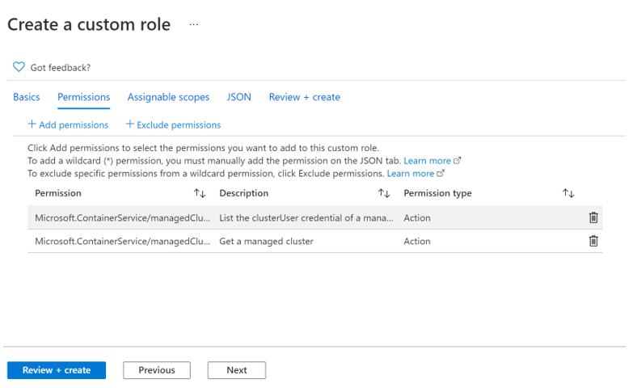

    * Add or Remove Permissions:

        * To add permissions, click Add permissions to open the Add permissions pane. This pane lists all available permissions grouped into different categories in a card format. Each category represents a resource provider, which is a service that supplies Azure resources.
        * In the Search for a permission box, type a string to search for permissions. For example, search for Container Service to find permissions related to it. A list of resource providers will be displayed based on your search string.
        
        * Click a resource provider card that might have the permissions you want to add to your custom role for e.g., here Microsoft Container Service. A list of the management permissions for that resource provider is displayed based on your search string.
        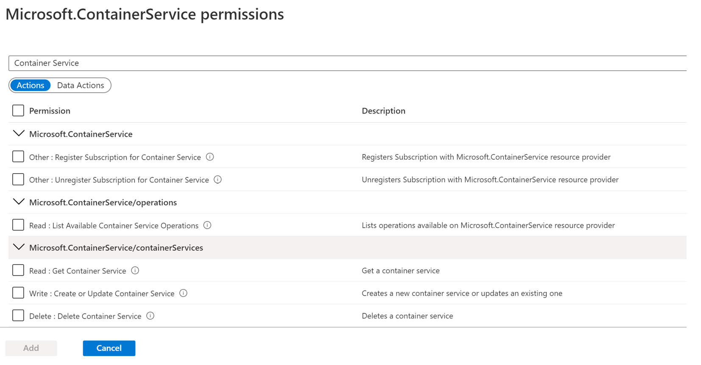
        * If you are looking for permissions that apply to the data plane, click Data Actions. Otherwise, leave the actions toggle set to Actions to list permissions that apply to the management plane. If necessary, update the search string to further refine your search. Once you find one or more permissions you want to add to your custom role, add a check mark next to the permissions.
        * Click Add to add the permission to your permission list. The permission gets added as an Actions or a Data-Actions.
        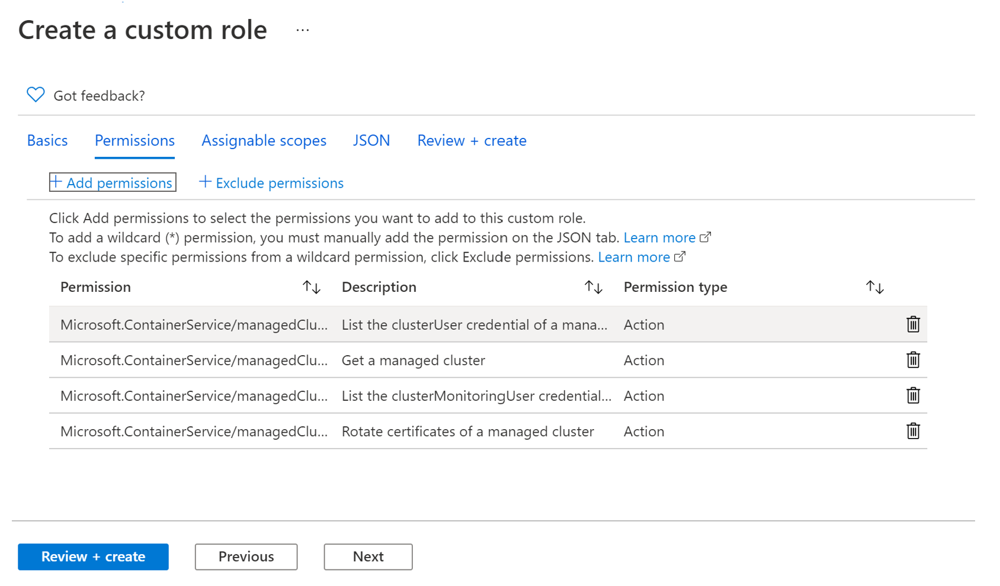
        * To remove permissions, click the delete icon at the end of the row.

        Depending on how you chose to start, you might have permissions with wildcards (\*) in your list of permissions. A wildcard (\*) extends a permission to everything that matches the action string you provide. 

        For example, the following wildcard string adds all permissions related to Azure Cost Management and exports. This would also include any future export permissions that might be added.
        `Microsoft.CostManagement/exports/*`

        If you want to add a new wildcard permission, you can't add it using the Add permissions pane. To add a wildcard permission, you must add it manually using the JSON tab.

        * If your role has a wildcard (\*) permission and you want to exclude or subtract specific permissions from that wildcard permission, you can exclude them. To do this select exclude permissions in the permissions tab.

        When you exclude a permission, it is added as a Not Actions or NotDataActions. The effective management permissions are computed by adding all the Actions and then subtracting all the NotActions. The effective data permissions are computed by adding all the DataActions and then subtracting all the NotDataActions. In our example we don’t have any permission needed to be excluded, so we will skip to the Assignable scope.

    * On the Assignable scopes tab, you specify where your custom role is available for assignment, such as subscription or resource group. Depending on how you chose to start, this tab might list the scope where you opened the Access control (IAM) page. Setting assignable scope to root scope ("/") is not supported. Currently, you cannot add a management group as an assignable scope.
    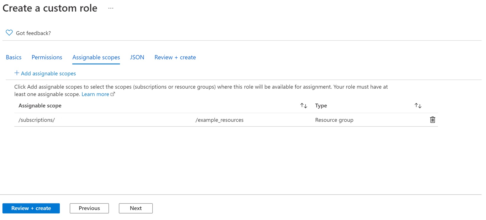

        * Click Add assignable scopes to open the Add assignable scopes pane. Click one or more scopes that you want to use, typically your subscription.
        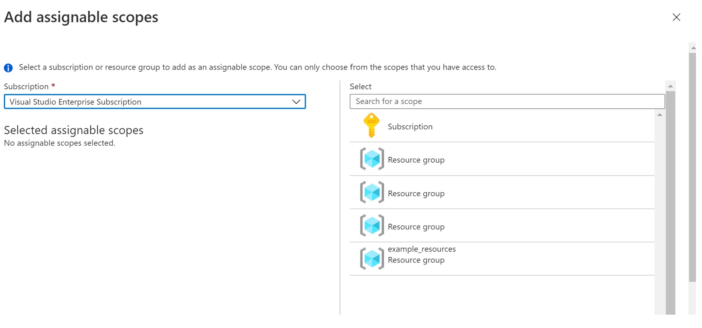
        * Click the Add button to add your assignable scope.

    * On the JSON tab, you see your custom role formatted in JSON. If you want, you can directly edit the JSON. If you want to add a wildcard (*) permission, you must use this tab.
    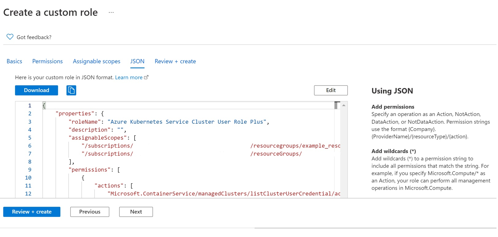

        * To edit the json, click **edit**.
        * Make changes if you want to include wildcard permissions. An improper formatted json will show jagged lines and indicators in the vertical gutter.
        * Click save to finish editing.

    * Review and Create

        * Click Create to create your custom role. After a few moments, a message box appears indicating your custom role was successfully created.
        * To view the role created by you head to the Access Control on the resource group/subscription and filter roles based on type: CustomRole or type the name of the role created.
    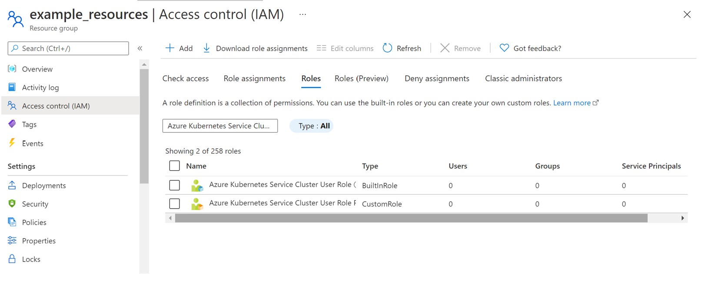

    * To edit the role, click on the ellipsis (…) at end of the new role and select edit. The custom role is opened in a similar edit pane and follow the above steps.
    * To delete first remove all the role assignments based on the role and then delete the role.

To create custom role via PowerShell: [Tutorial: Create an Azure custom role with Azure PowerShell - Azure RBAC | Microsoft Docs](https://docs.microsoft.com/en-us/azure/role-based-access-control/tutorial-custom-role-powershell)

To create custom role via CLI: [Tutorial: Create an Azure custom role with Azure CLI - Azure RBAC | Microsoft Docs](https://docs.microsoft.com/en-us/azure/role-based-access-control/tutorial-custom-role-cli)

