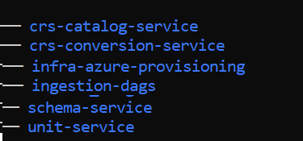

# Pre-requisite

__Repository__

Clone the following repository and have them in the same file structure level as infra repository using following commands

```bash
// you should be at one directory level above infra-azure-provisioning
export BRANCH_NAME="release/0.10" // branch name for the release 0.10.0

git clone -b $BRANCH_NAME --single-branch https://community.opengroup.org/osdu/platform/system/reference/crs-catalog-service.git
git clone -b $BRANCH_NAME --single-branch https://community.opengroup.org/osdu/platform/system/reference/crs-conversion-service.git
git clone -b $BRANCH_NAME --single-branch https://community.opengroup.org/osdu/platform/data-flow/ingestion/ingestion-dags.git
git clone -b $BRANCH_NAME --single-branch https://community.opengroup.org/osdu/platform/system/schema-service.git
git clone -b $BRANCH_NAME --single-branch https://community.opengroup.org/osdu/platform/system/reference/unit-service.git
```


Change directory to `infra-azure-provisioning`

# Configuration Data Upload Instructions

__CLI Login__

Login to Azure CLI using the OSDU Environment Service Principal.

```bash
# This logs your local Azure CLI in using the configured service principal.
az login --service-principal -u $ARM_CLIENT_ID -p $ARM_CLIENT_SECRET --tenant $ARM_TENANT_ID
```

## Upload Configuration Data

3 services that required configuration data to be loaded into the configuration storage account file shares.

### Unit

```bash
FILE_SHARE="unit"
FILE=$(realpath ../unit-service/data/unit_catalog_v2.json)

GROUP=$(az group list --query "[?contains(name, 'cr${UNIQUE}')].name" -otsv)
ENV_VAULT=$(az keyvault list --resource-group $GROUP --query [].name -otsv)

az storage file upload \
  --account-name $(az keyvault secret show --id https://${ENV_VAULT}.vault.azure.net/secrets/airflow-storage --query value -otsv) \
  --account-key $(az keyvault secret show --id https://${ENV_VAULT}.vault.azure.net/secrets/airflow-storage-key --query value -otsv) \
  --share-name ${FILE_SHARE} \
  --source ${FILE}
```

### CRS Catalog

```bash
FILE_SHARE="crs"
FILE=$(realpath ../crs-catalog-service/data/crs_catalog_v2.json)

GROUP=$(az group list --query "[?contains(name, 'cr${UNIQUE}')].name" -otsv)
ENV_VAULT=$(az keyvault list --resource-group $GROUP --query [].name -otsv)

az storage file upload \
  --account-name $(az keyvault secret show --id https://${ENV_VAULT}.vault.azure.net/secrets/airflow-storage --query value -otsv) \
  --account-key $(az keyvault secret show --id https://${ENV_VAULT}.vault.azure.net/secrets/airflow-storage-key --query value -otsv) \
  --share-name ${FILE_SHARE} \
  --source ${FILE}
```

### CRS Conversion

```bash
FILE_SHARE="crs-conversion"
PROJECT_FOLDER=$(realpath ../crs-conversion-service)
SOURCE_FOLDER="apachesis_setup/**"

GROUP=$(az group list --query "[?contains(name, 'cr${UNIQUE}')].name" -otsv)
ENV_VAULT=$(az keyvault list --resource-group $GROUP --query [].name -otsv)

az storage file upload-batch \
  --account-name $(az keyvault secret show --id https://${ENV_VAULT}.vault.azure.net/secrets/airflow-storage --query value -otsv) \
  --account-key $(az keyvault secret show --id https://${ENV_VAULT}.vault.azure.net/secrets/airflow-storage-key --query value -otsv) \
  --destination $FILE_SHARE \
  --source ${PROJECT_FOLDER} \
  --pattern ${SOURCE_FOLDER}
```

# Ingest Manifest DAGS

Manifest Ingestion Dags have now support for Packaged dags therefore we will upload a zip folder containing manifest dags

###Steps
- Clone manifest ingestion repository from [here](https://community.opengroup.org/osdu/platform/data-flow/ingestion/ingestion-dags/-/tree/master)
- Ensure python 3.8 or higher is installed
- From root of the repository run the command
``python deployments/scripts/azure/zip_dags.py``
- This will output a zipped file named as "manifest_ingestion_dags.zip"
- Now execute the below script to upload the dag zip file to File share
```bash
FILE_SHARE="airflow2dags"
# Airflow 2.x is recommended over Airflow 1.x
# To keep on using Airflow 1.x use "airflowdags"
FILE_NAME="manifest_ingestion_dags.zip"
PROJECT_FOLDER=$(realpath ../ingestion-dags/src)

GROUP=$(az group list --query "[?contains(name, 'cr${UNIQUE}')].name" -otsv)
ENV_VAULT=$(az keyvault list --resource-group $GROUP --query [].name -otsv)

az storage file upload \
  --account-name $(az keyvault secret show --id https://${ENV_VAULT}.vault.azure.net/secrets/airflow-storage --query value -otsv) \
  --account-key $(az keyvault secret show --id https://${ENV_VAULT}.vault.azure.net/secrets/airflow-storage-key --query value -otsv) \
  --share-name $FILE_SHARE/dags \
  --source $FILE_NAME
```
