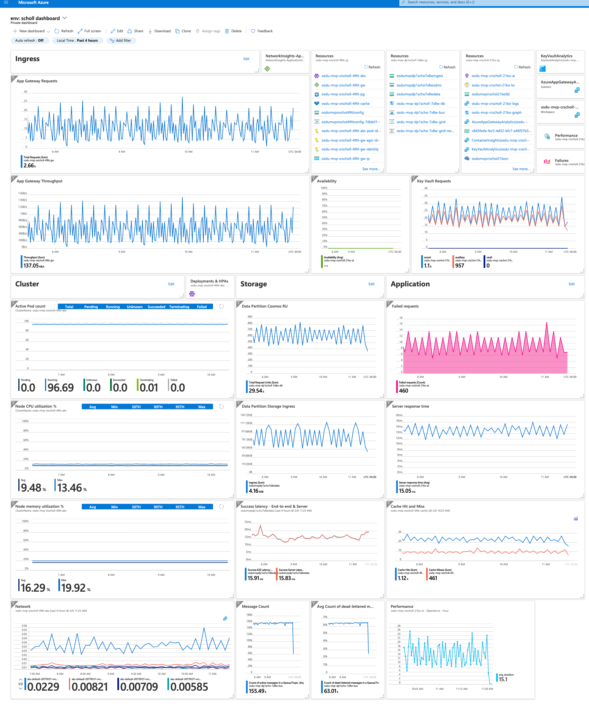
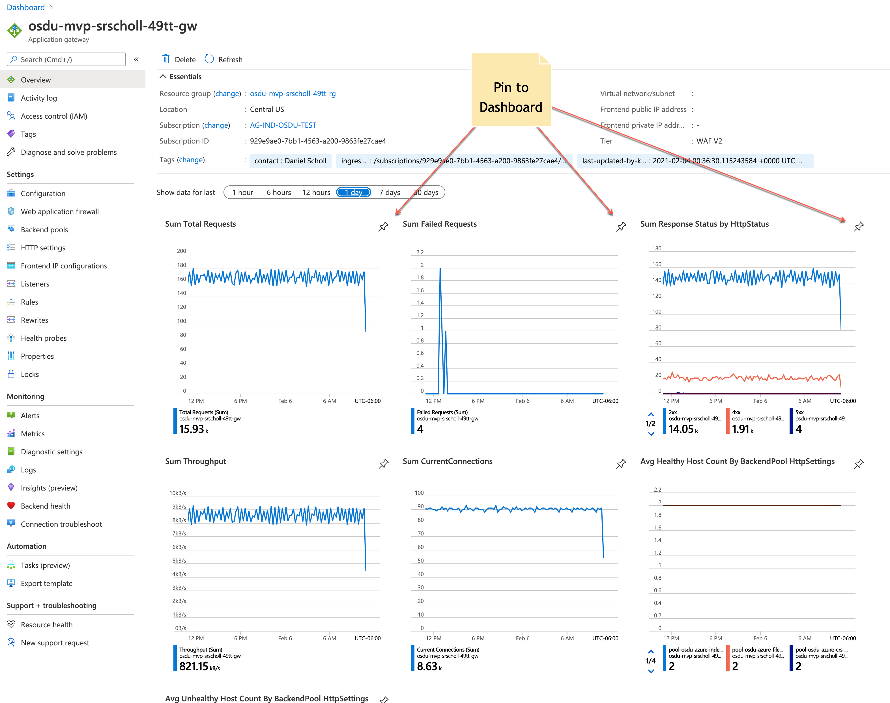
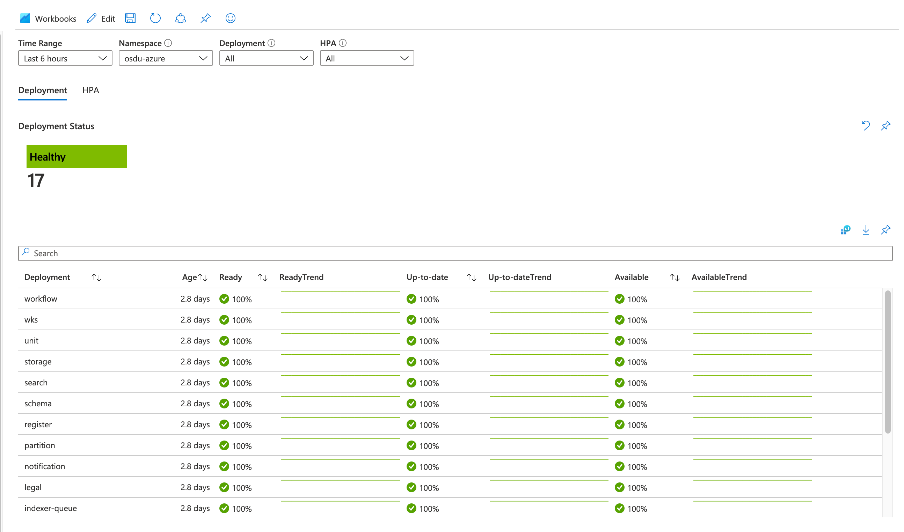
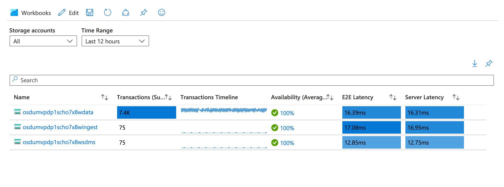
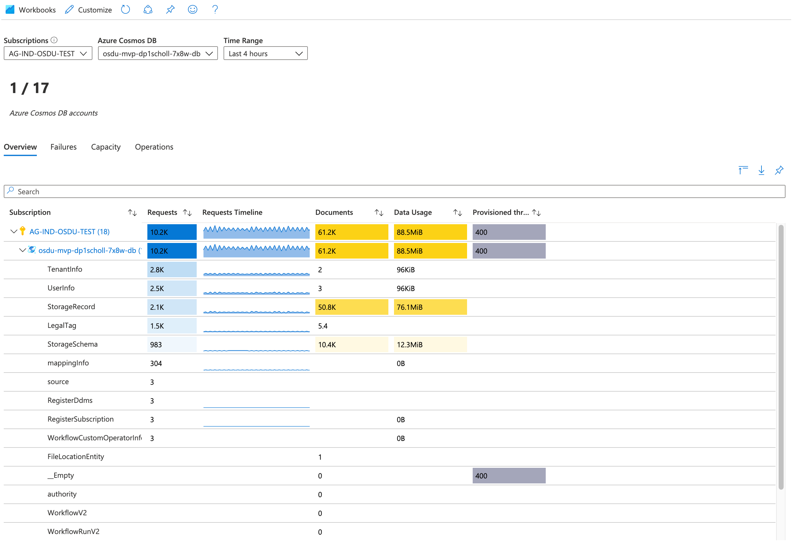
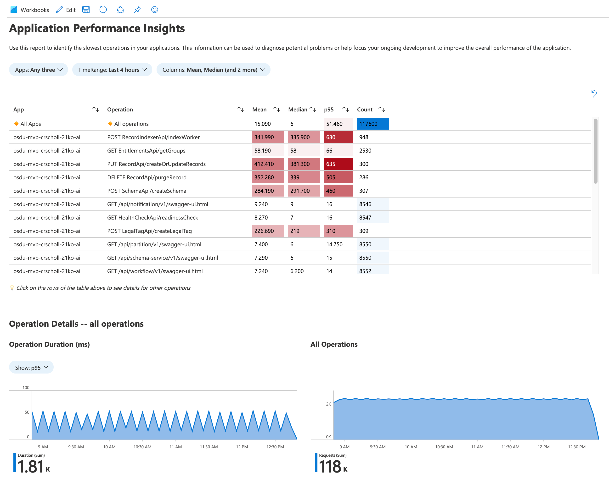

# OSDU on Azure Dashboards

Dashboards and the need for dashboarding often differs depending upon what type of things are considered important and preference in where and how the information is displayed.  This documentation is meant as some initial guidance on the topic with some examples and suggestions.

There are several Azure native technologies which can be leveraged to monitor OSDU on Azure each come with advantages and disadvantages.

## Azure Dashboards Overview

[Azure dashboards](https://docs.microsoft.com/en-us/azure/azure-portal/azure-portal-dashboards) are the primary dashboarding technology for Azure. They're particularly useful in providing single pane of glass over your Azure infrastructure and services allowing you to quickly identify important issues.

- Deep integration into Azure.
- Supports both metrics and logs.
- Combine data from multiple sources.
- Automatic Refresh
- Limited Contextual drill down.
- Customizable, user created and shared.

### Reference Dashboards

A terraform template exists that can help expediate setting up some dashboards as examples that can be levaraged to easily get started.

Terraform Template Dashboards can be found [here](../infra/monitoring_resources/README.md).

### Sample Dashboard

Here is an example of what an OSDU Dashboard might look like.

__Suggested items of interest to monitor__

- Ingress
  - Application Gateway Ingress `Total Requests: Sum`
  - Application Gateway Throughput `Throughput: Sum`

- Compute
  - Azure Kubernetes Service `Node CPU utilization %`
  - Azure Kubernetes Service `Node Memory utilization %`
  - Azure Kubernetes Service `Active Pod Count`

- Storage
  - Cosmos Database `Total Requests Units: Sum`
  - Storage Account `Ingress: Sum`
  - Storage Account `Egress: Sum`
  - Storage Account `Latency: End to End`

- Messages
  - Service Bus `Count of active messages: Avg`
  - Service Bus `Count of dead letter messages: Avg`

- Secrets
  - Key Vault `Total Service API Hits: Count`

- Cache
  - Azure Redis `Cache Hits`
  - Azure Redis `Cache Miss`

- Application
  - Application Insights `Failed Request Count`
  - Application Insights `Availability`
  - Application Insights `Performance: Server Response Time`

__Tips and Tricks__

1. Label sections in the dashboard using a markdown tile with an empty `Title` or `Subtitle`.
2. A dashboard can also be used to assist in navigation efforts by pinning direct resources or groups to the dashboard.
3. Ensure that no tile dashboard time settings are overridden so that the time range can be modified for all graphs.

### Azure Resource Insights and Overviews

Individual resources have what might be thought of as a small resource specific dashboards that provide relevant information specific to that resource type.  These items can be found often in the resource `overview` tab or under the `insights` tab.

These items often provide ideas on what things might be important in regards to those types of resources that should be monitored and can lead to addtional items of interest to place on a default dashboard.

Each service has different methods of displaying this type of information and might be using different combinations of technology and dashboarding to visualize important information.

These items can often be pinned to a dashboard to assist in the creation and layout effort of building a customizable dashboard.

    _Resource Dashboard_

### Additional Help

1. Video: [How to create dashboards](https://www.microsoft.com/en-us/videoplayer/embed/RE4AslH).
2. Video: [How to monitor Kubernetes Clusters](https://www.youtube.com/watch?v=RjsNmapggPU&feature=emb_logo)
3. Video: [How to perform analysis with Application Insights](https://www.youtube.com/watch?v=-5e0sexdyc0)

## Azure Workbooks Overview

## Workbooks

[Workbooks](https://docs.microsoft.com/en-us/azure/azure-monitor/platform/workbooks-overview) are interactive documents that provide deep insights into your data, investigation, and collaboration inside the team. Specific examples where workbooks are useful are troubleshooting guides and incident postmortem.

- Supports both metrics and logs.
- Supports parameters enabling interactive reports.
- No automatic refresh.
- No dense layout.

### Sample Workbooks

Here are some examples of what resource workbooks look like.

__Azure Kubernetes Service Containers__

__Azure Storage Accounts__

__Azure Cosmos Database__

__Azure Application Performance__

### Additional Help

1. Video: [How to create workbooks](https://www.microsoft.com/en-us/videoplayer/embed/RE4B4Ap)

