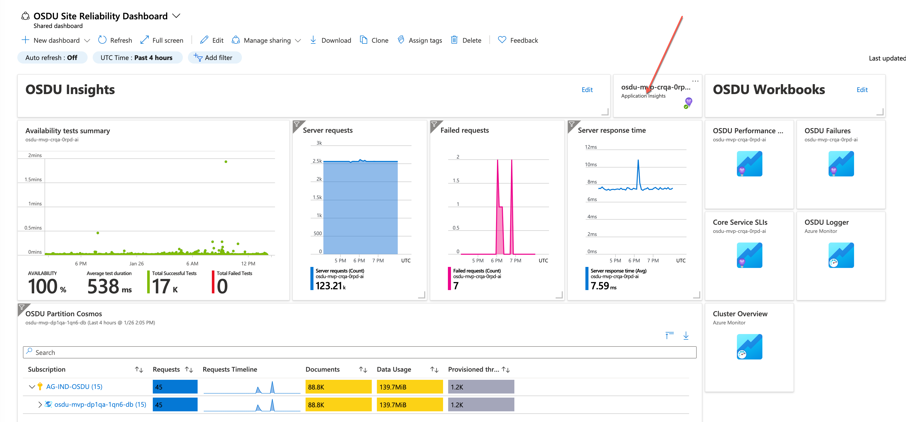
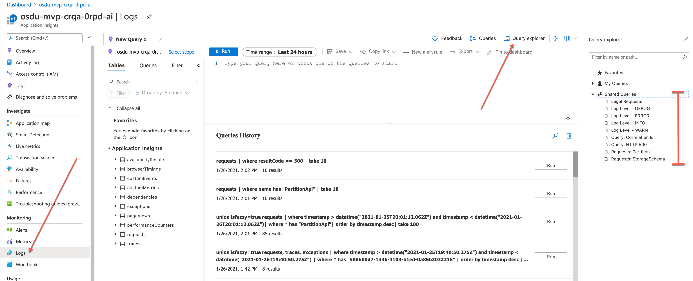
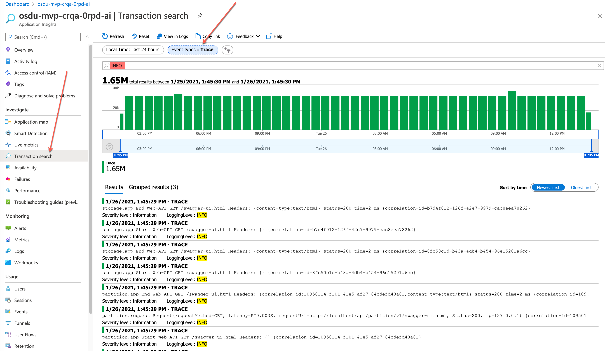
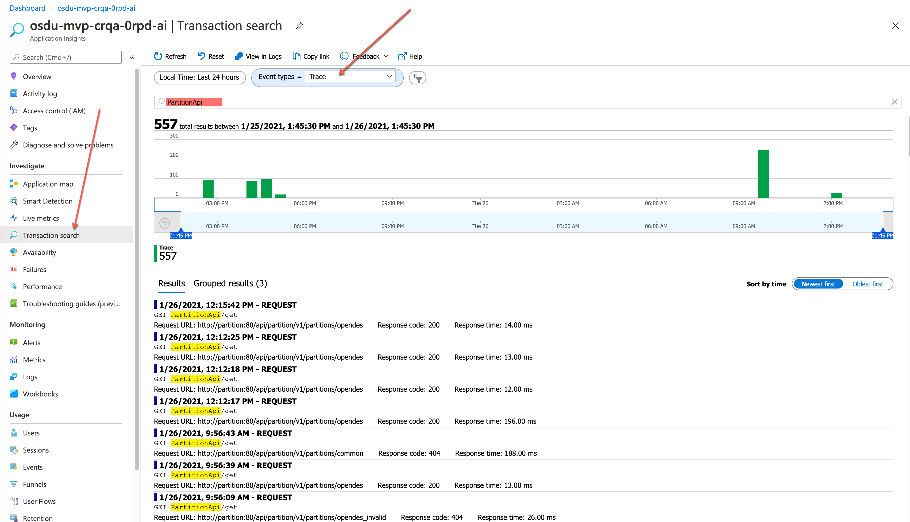
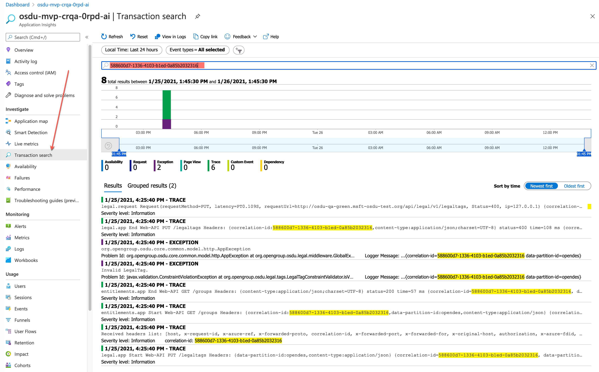
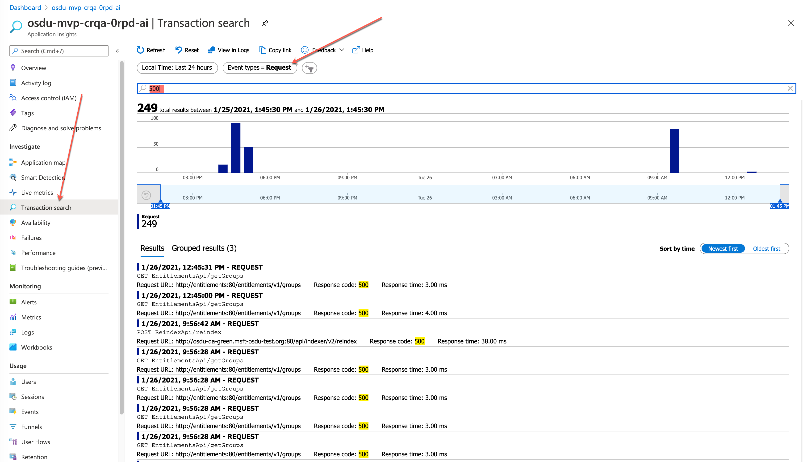

## Querying Log Messages in Application Insights

The Azure OSDU implementation uses [Application Insights](https://portal.azure.com/#@azureglobal1.onmicrosoft.com/resource/subscriptions/8e710845-064e-435a-a353-7fb6a91cca0f/resourceGroups/osdu-mvp-crqa-0rpd-rg/providers/Microsoft.Insights/components/osdu-mvp-crqa-0rpd-ai/overview) to visualize and query logs. 

When deploying the Azure instance of OSDU, a default application insights template and configuration is deployed and configured as part of the infrastructure. This is a reference instance and can be modified by customers to better fit their observability needs. 

The following steps walks a user through visualizating logs, searching and corrolation in the Azure instance of OSDU.

 

1. ***From Site Reliability Dashboard Select Application Insights***

    
    _The Azure App Insights Dashboard for OSDU_

 

2. ***Select Logs and Open Query Explorer then Expand Search Queries***

    
    _Querying in App Insights_

 

3. ***Filterning Log Levels***
     
    >App Insights will allow you to filter the specific log level required, ie, DEBUG, INFO, WARNING, or ERROR
    
        In order to do that, query the "traces" table as follows: 

        Sample Query:  traces
            | where severityLevel == 0
            | take 10
            
        Saved Queries:
            1.	Log Level – INFO
            2.	Log Level – DEBUG
            3.	Log Level – WARN
            4.	Log Level -- ERROR

    
    _Transaction Search in App Insights_

 

4. ***Query Logs for certain requests***

    >Location: Application Insights
        Table: requests

        Sample Query:  requests
        | where name contains "PartitionApi" 
        | take 10
        Saved Queries:
        1.	Requests – Partition
        2.	Requests – StorageSchema
    
    _Transaction Search in App Insights for Request_

 

5. ***Query Logs For a Corrolation Id***
   
    >Location: Application Insights

        Sample Query:  union isfuzzy=true requests, traces, exceptions
        | where timestamp > datetime("2021-01-25T19:40:50.275Z") and timestamp < datetime("2021-01-26T19:40:50.275Z")
        | where * has "588600d7-1336-4103-b1ed-0a85b2032316"
        | order by timestamp desc
        | take 100

        Saved Queries:
        1.	Query: Correlation Id
    
    _Transaction Search in App Insights For Corrolation Id_

 

6. ***Query Logs For an Error Code (ex 500)***

    >Location: Application Insights

        Sample Query:  requests
        | where resultCode == 500
        | take 10

        Saved Queries:
        1.	Query: HTTP 500
    
    
    _Searching for 500 Err Code_ 

    

