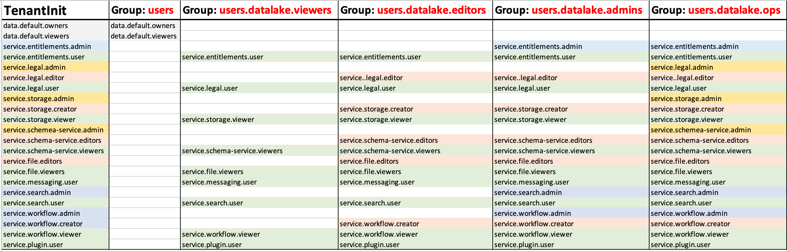

# OSDU Users, Groups and Entitlements

Entitlements v2 utilizes a new Graph Database and the process of how Users and Roles works becomes somewhat simplier. The steps below hopefully provide more insight to how to manually add users and properly entitle those users.

__Initialize the Tenant for Entitlements__
> Note: A tenant in entitlements essentially aligns with the concept of a Data Partition.

There is a method in the entitlement service called tenant-provisioning.  This will create the required group structures necessary for the tenant (Partition).  Additionally the Service Principal will be established in the required groups at this time.

__Create a Member__ _(User)_

Next a user has to be added into the user group for the Tenant.  This will automatically add the following entitlements required for data access to the user.

  - data.default.owners
  - data.default.viewers

__Add the Member to a group__

When initializing the tenant 4 Groups _(Roles)_ are created that have entitlements associated to them.

  - users.datalake.viewers - This can be thought of as a Reader Role.
  - users.datalake.editors - This can be thought of as a Contributor Role.
  - users.datalake.admins - This can be thought of as an Administrator Role without data delete.
  - users.datalake.ops - This can be thought of as an Owner Role.
  - users.data.root - This can be thought of as a Data Level Owner Role, any member which is part of this group will get access to all the data (storage records) in a data partition.

The following chart can prove to be useful to see the different levels of access that exist for the different groups.

_Default OSDU Entitlement Groups_

_** This [script](../tools/rest/entitlement_manage.http) can be helpful to manually manage users._
