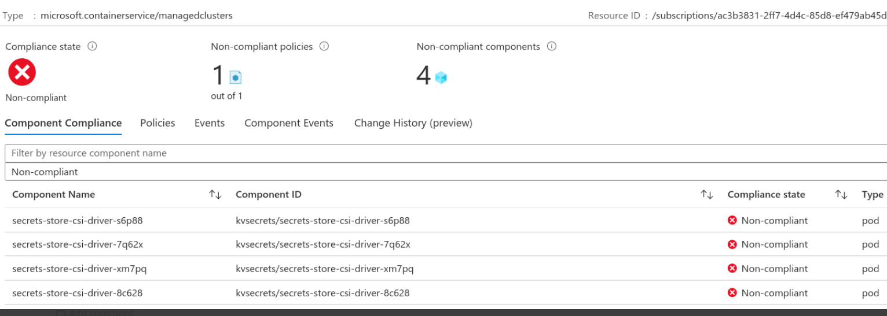

# AKS pod policies

Reference links:

* [AKS engine policy reference](https://docs.microsoft.com/en-us/azure/aks/policy-reference#aks-engine)
* [AKS initiatives](https://docs.microsoft.com/en-us/azure/aks/policy-reference#initiatives)
* [Understand AKS policies](https://docs.microsoft.com/en-us/azure/governance/policy/concepts/policy-for-kubernetes)
* [Validate Policy](https://docs.microsoft.com/en-us/azure/aks/use-azure-policy#validate-a-azure-policy-is-running)

Applied changes:

* Refactored AKS module added policies.tf
* Optional installation of policies
* Refactored variables, removed dashboard
* Terraform azurerm provider needed __2.98.0__
  * If you're planning to upgrade provider, use `-upgrade` while doing `terraform init`.

## Optional policy installation

In __service resources__ terraform stage [service_resources/main.tf](../../infra/templates/osdu-r3-mvp/service_resources/main.tf), you can enable or disable policy installation in aks module:

```terraform
module "aks" {
  source = "../../../modules/providers/azure/aks"

  name                = local.aks_cluster_name
  # ... More parameters ... #
  # Optional policy enablement
  azure_policy_enabled      = true   

  resource_tags = var.resource_tags
}
```

### Policies introduced as for now (2022-04)

* Authorized IP ranges should be defined on Kubernetes (audit)
* AKS private clusters should be enabled (audit)
* AKS should not allow privileged containers (deny)
* AKS should not allow container privilege escalation (deny)
* Kubernetes cluster pods should only use allowed volume types (deny)
* Kubernetes cluster pod hostPath volumes should only use allowed host path (deny)
* Kubernetes cluster pods should only use approved host network and port range (deny)

### Downtime and what to expect

__NOTE__: If policy is applied when a workload (pod) is runnigt and does not meet policy condition, downtime will not happen, Azure will mark that pod as non-compliant, however, if the pod gets recreated, the pod will not start due policy violation.

Screenshots and AKS non-compliant policy:



Test for not allowed privileged pod:

```yaml
kind: Pod
metadata: 
  name: nginx-privilege-escalation-allowed
  labels: 
    app: nginx-privilege-escalation
spec: 
  containers: 
  - name: nginx
    image: nginx
    securityContext: 
      allowPrivilegeEscalation: true
```

```shell
kubectl apply -f not-allowed.yaml 

Error from server ([azurepolicy-psp-container-no-privilege-esc-e6a74aee95507167737f] Privilege escalation container is not allowed: nginx): error when creating "not-allowed.yaml": admission webhook "validation.gatekeeper.sh" denied the request: [azurepolicy-psp-container-no-privilege-esc-e6a74aee95507167737f] Privilege escalation container is not allowed: nginx
```

## How to fix policies (2022/04)

Most of the policies introduced are already compliant, by using recommended parameters for `flux`, `kvsecrets`, `podidentity`, those policies are being checked with gatewaykeeper built-in AKS plugin.

Nevertheless, we have 2 remaining policies which will be checked at Azure resource level, and those can be fixed easily, however you may need to find another approach to install and connect to your AKS cluster [Options to connect](https://docs.microsoft.com/en-us/azure/aks/private-clusters#options-for-connecting-to-the-private-cluster).

* AKS private clusters should be enabled (audit)
  1. [Disable AKS Public FQDN](https://docs.microsoft.com/en-us/azure/aks/private-clusters#disable-public-fqdn)
  2. [Configure Private DNS ZONE](https://docs.microsoft.com/en-us/azure/aks/private-clusters#configure-private-dns-zone)
  * [Options to connect](https://docs.microsoft.com/en-us/azure/aks/private-clusters#options-for-connecting-to-the-private-cluster)
* Authorized IP ranges should be defined on Kubernetes (audit)
  * Use the parameter `aks_authorized_ip_ranges` in the [terraform.tfvars](../../infra/templates/osdu-r3-mvp/service_resources/terraform.tfvars) on `service resources` stage, I.E:
  * Also you can change this manually in Azure console in `AKS > Networking > Security > Set authorized IP ranges`

Example in [terraform.tfvars](../../infra/templates/osdu-r3-mvp/service_resources/terraform.tfvars) on `service resources` (EOF).

```terraform
aks_authorized_ip_ranges = ["192.168.0.1/24", "192.168.2.1/24" ...]
```

## Policy exceptions

* __Namespaces__
  * __Kube System__: Installation of kvsecrets, csi provider and podidentity helm charts will be done here.
  * __Gatekeeper system__: Policy add-on requires privileges,therefore we need to add exception for this namespace.
  * __agic__: AGIC controller does requires hostPath:

```yaml
  - hostPath:
        path: /etc/kubernetes/
        type: Directory
```

* __Containers__
  * __discovery__: `istiod` container does not have current options to put `allowPrivilegeEscalation: false`.
  * __configure-sysctl__: Can be removed if Elastic is not installed in current AKS, just needed in case EKS cluster will be installed in AKS.

## Subscription level policies

We are using built-in AKS policies which are customized to work with OSDU components:

* __deny_privilege_escalation__ policy __"Kubernetes clusters should not allow container privilege escalation"__.
  * We are excluding potential containers which may need these privileges (`configure-sysctl`, `discovery`), unfortunately there is deep configuration to do in these containers which will broke functionality, therefore those should be excluded as well at policy subscription level as well.
* __deny_privileged_containers__
  * (`configure-sysctl`, `discovery`), can be excluded by setting this in the parameters policy at subscription level.
